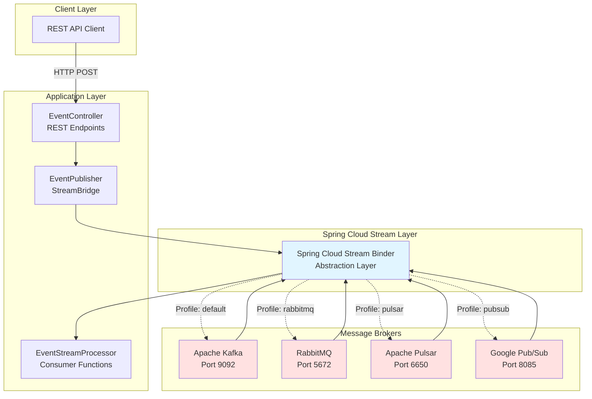
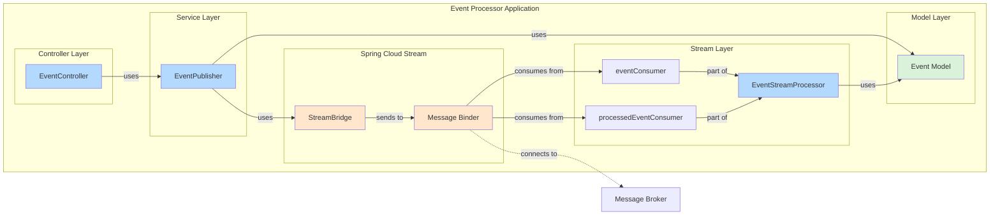
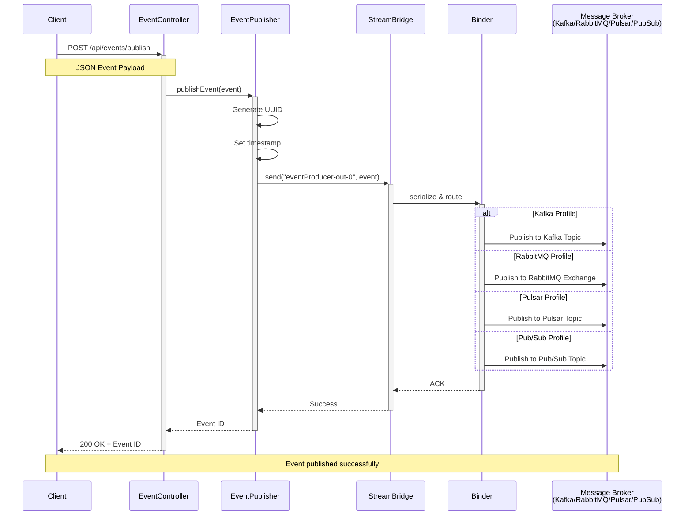
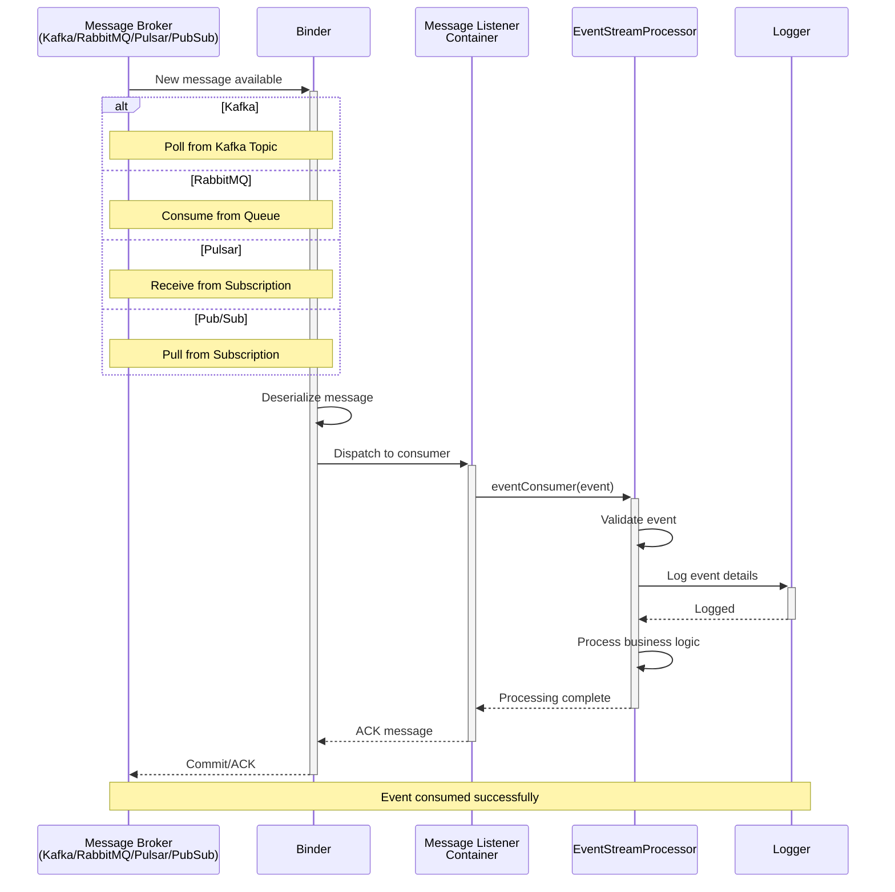
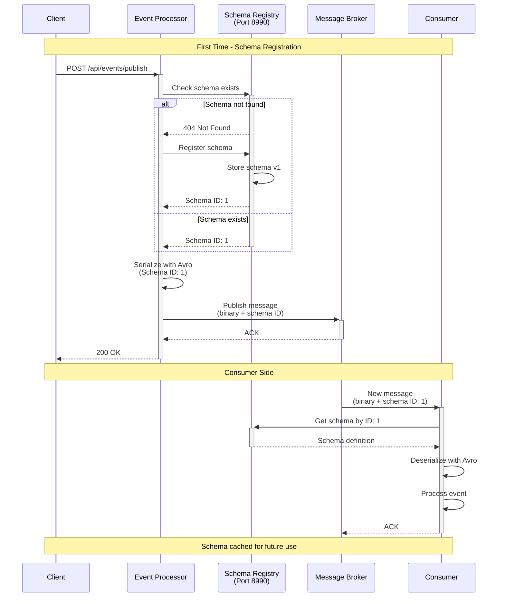
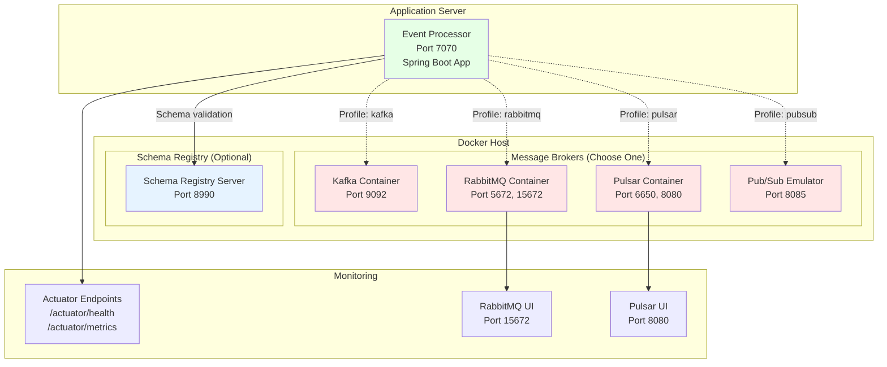
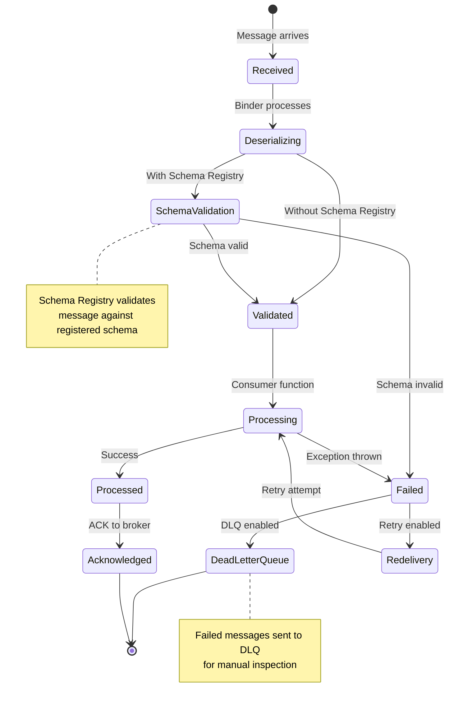
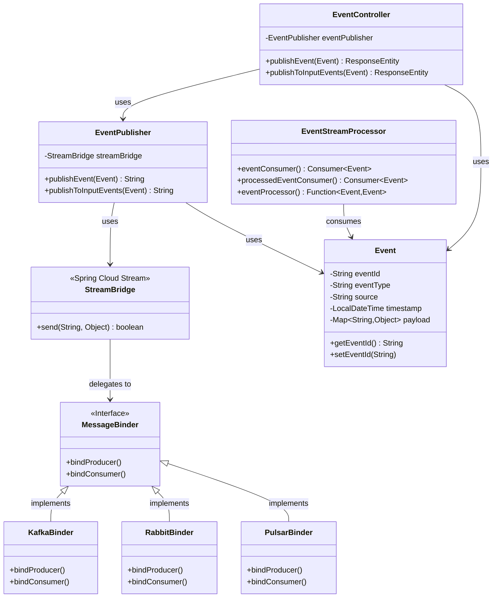
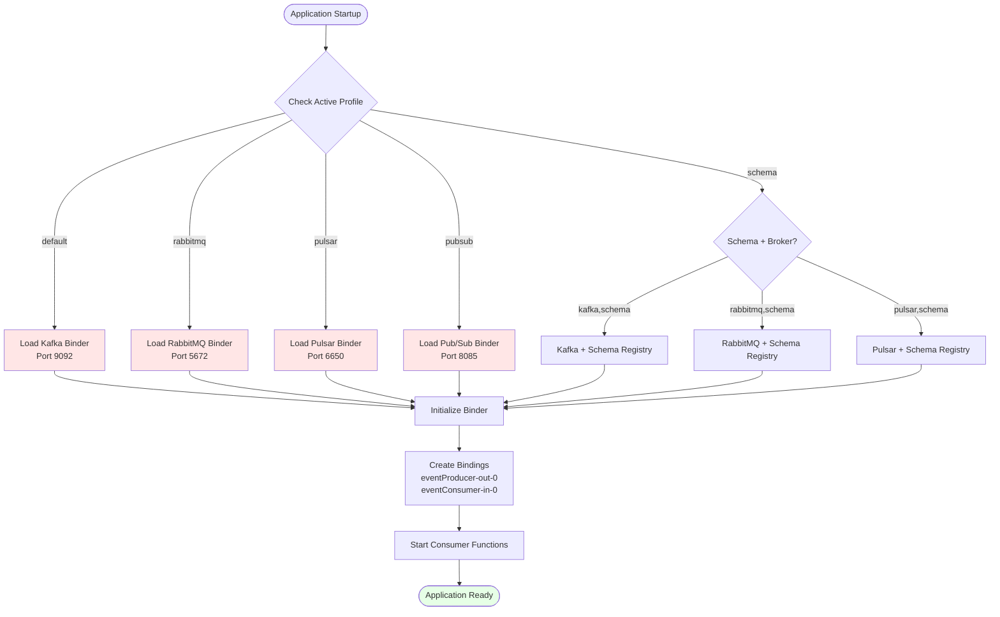

# Architecture Diagrams

This document contains Mermaid diagrams for the Event Processor messaging-agnostic microservice.

## 1. High-Level Architecture Diagram



## 2. Component Diagram



## 3. Sequence Diagram - Publish Event



## 4. Sequence Diagram - Consume Event



## 5. Sequence Diagram - With Schema Registry



## 6. Deployment Diagram



## 7. State Diagram - Message Processing



## 8. Class Diagram



## 9. Data Flow Diagram

```mermaid
flowchart LR
    subgraph "Input"
        HTTP[HTTP Request<br/>JSON Payload]
    end
    
    subgraph "Application Processing"
        Controller[EventController<br/>Validate & Route]
        Publisher[EventPublisher<br/>Enrich Event]
        Bridge[StreamBridge<br/>Send to Binding]
    end
    
    subgraph "Spring Cloud Stream"
        Binding[Output Binding<br/>eventProducer-out-0]
        Binder[Message Binder<br/>Serialize & Convert]
    end
    
    subgraph "Message Broker"
        Topic[Topic/Exchange/Queue<br/>processed-events]
    end
    
    subgraph "Consumer Processing"
        InBinding[Input Binding<br/>processedEventConsumer-in-0]
        Deserialize[Deserialize<br/>JSON/Avro to Event]
        Consumer[Consumer Function<br/>Business Logic]
    end
    
    subgraph "Output"
        Log[Application Logs<br/>Event Processed]
    end
    
    HTTP --> Controller
    Controller --> Publisher
    Publisher -->|Add UUID<br/>Add Timestamp| Bridge
    Bridge --> Binding
    Binding --> Binder
    Binder -->|Serialize| Topic
    Topic -->|Poll/Consume| InBinding
    InBinding --> Deserialize
    Deserialize --> Consumer
    Consumer --> Log
    
    style HTTP fill:#e1f5ff
    style Topic fill:#ffe1e1
    style Log fill:#e1ffe1
```



## 10. Profile Selection Flow



## Usage in README

These diagrams are already integrated into README.md. GitHub and most Markdown viewers support Mermaid rendering natively.

### Diagrams in README.md:

1. ✅ **High-Level Architecture** - Shows client, application, binder, and broker layers
2. ✅ **Publish Event Sequence** - Complete message publishing flow
3. ✅ **Consume Event Sequence** - Message consumption flow
4. ✅ **Component Diagram** - Application components and relationships
5. ✅ **Deployment Diagram** - Docker containers and infrastructure

### Additional Diagrams (Available Here):

6. **Schema Registry Sequence** - Schema validation flow
7. **State Diagram** - Message processing states
8. **Class Diagram** - Java class relationships
9. **Data Flow Diagram** - Data transformation flow
10. **Profile Selection Flow** - Profile-based configuration

### How to View:

**On GitHub:**
```bash
git add .
git commit -m "Add architecture diagrams"
git push
# View on GitHub - Mermaid renders automatically
```

**Locally:**
- VS Code: Install "Markdown Preview Mermaid Support" extension
- IntelliJ IDEA: Built-in Mermaid support
- Browser: Use Mermaid Live Editor (https://mermaid.live)

### Copy Individual Diagrams:

To add any diagram to another document, copy the entire mermaid code block:

```markdown
```mermaid
[paste diagram code here]
```
```

All diagrams are production-ready and demonstrate the messaging-agnostic architecture with schema registry support.
