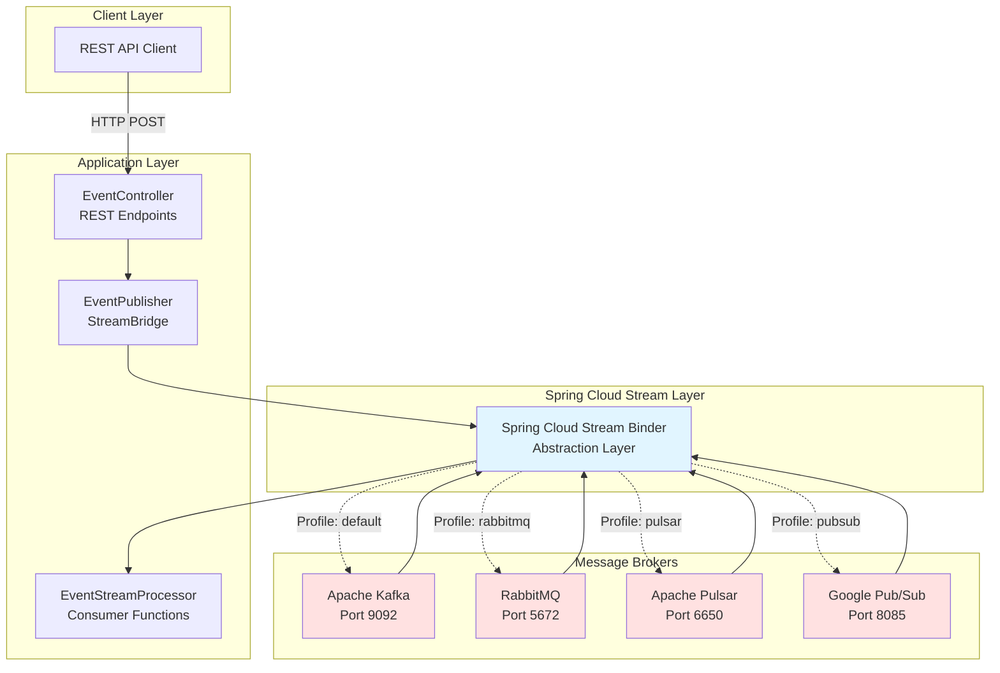
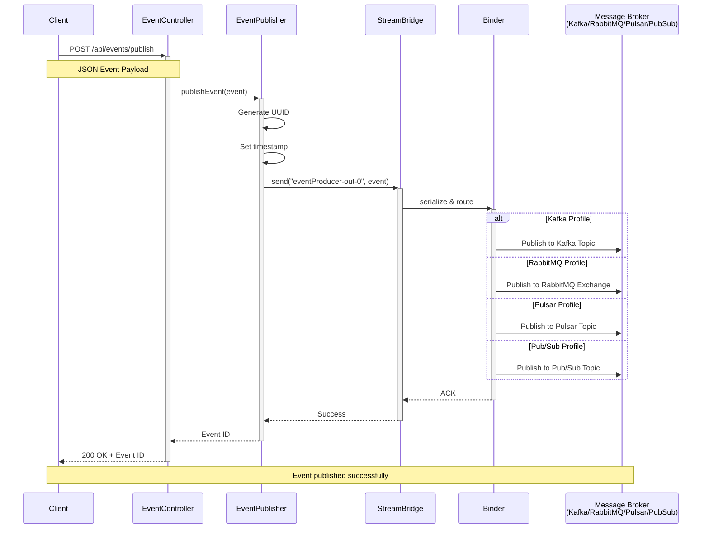
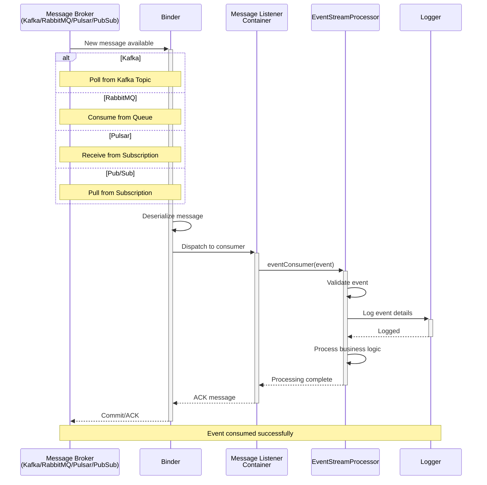
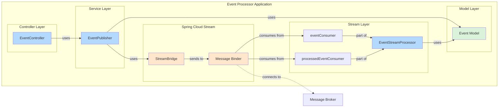
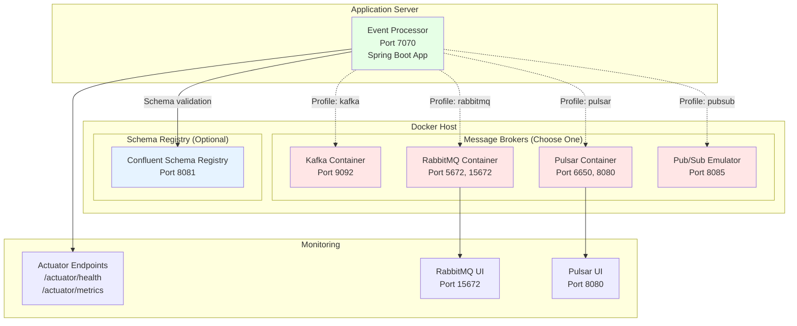

# Event Processor - Messaging Agnostic Microservice

This microservice demonstrates **messaging-agnostic architecture** using Spring Cloud Stream, allowing you to switch between different message brokers (Kafka, RabbitMQ, Google Pub/Sub, Apache Pulsar) **without changing any code**.

## Architecture

- **Spring Cloud Stream**: Provides abstraction over messaging systems
- **Functional Programming Model**: Uses Java functions (Consumer, Function, Supplier)
- **Binder Pattern**: Pluggable binders for different messaging systems

## Project Structure

```
event-processor/
├── src/main/java/com/charter/elf/eventprocessor/
│   ├── EventProcessorApplication.java
│   ├── controller/
│   │   └── EventController.java
│   ├── model/
│   │   └── Event.java
│   ├── service/
│   │   └── EventPublisher.java
│   └── stream/
│       └── EventStreamProcessor.java
└── src/main/resources/
    └── application.yml
```

## Key Components

### 1. EventStreamProcessor (Functional Beans)
- `eventConsumer()`: Consumes events from input-events topic
- `eventProcessor()`: Transforms/processes events

### 2. EventPublisher
- Uses `StreamBridge` to publish events dynamically

### 3. EventController
- REST API to manually trigger events for testing

## Configuration (application.yml)

```yaml
spring:
  cloud:
    stream:
      bindings:
        eventProducer-out-0:
          destination: processed-events
        eventConsumer-in-0:
          destination: input-events
```

## Supported Message Brokers

| Broker | Profile | Port | Status | Guide |
|--------|---------|------|--------|-------|
| **Apache Kafka** | `kafka` | 9092 | ✅ Active | Default |
| **RabbitMQ** | `rabbitmq` | 5672 | ⚠️ Commented | [SWITCH-TO-RABBITMQ.md](SWITCH-TO-RABBITMQ.md) |
| **Apache Pulsar** | `pulsar` | 6650 | ⚠️ Commented | [SWITCH-TO-PULSAR.md](SWITCH-TO-PULSAR.md) |
| **Google Pub/Sub** | `pubsub` | 8085 | ⚠️ Commented | [SWITCH-TO-PUBSUB.md](SWITCH-TO-PUBSUB.md) |

**Note:** Only Kafka binder is active by default. To test other brokers, uncomment the respective dependency in `pom.xml`.

## Quick Start

### Prerequisites
- Java 17+
- Maven 3.6+
- Docker

### Option 1: Run with Kafka (Default)

```bash
# Start Kafka Cluster (3 nodes) + Schema Registry
docker-compose up -d

# Build and run
mvn clean install
mvn spring-boot:run -Dspring-boot.run.profiles=kafka
```

### Option 2: Run with RabbitMQ

**Step 1:** Uncomment RabbitMQ dependency in `pom.xml`:
```xml
<dependency>
    <groupId>org.springframework.cloud</groupId>
    <artifactId>spring-cloud-stream-binder-rabbit</artifactId>
</dependency>
```

**Step 2:** Start RabbitMQ and run:
```bash
# Start RabbitMQ
docker run -d --name rabbitmq -p 5672:5672 -p 15672:15672 \
  -e RABBITMQ_DEFAULT_USER=admin \
  -e RABBITMQ_DEFAULT_PASS=admin \
  rabbitmq:3-management

# Run with RabbitMQ profile
mvn clean install
mvn spring-boot:run -Dspring-boot.run.profiles=rabbitmq
```

### Option 3: Run with Apache Pulsar

**Step 1:** Uncomment Pulsar dependency in `pom.xml`:
```xml
<dependency>
    <groupId>org.springframework.cloud</groupId>
    <artifactId>spring-cloud-stream-binder-pulsar</artifactId>
</dependency>
```

**Step 2:** Start Pulsar and run:
```bash
# Start Pulsar
docker run -d --name pulsar -p 6650:6650 -p 8080:8080 \
  apachepulsar/pulsar:3.1.0 bin/pulsar standalone

# Run with Pulsar profile
mvn clean install
mvn spring-boot:run -Dspring-boot.run.profiles=pulsar
```

### Option 4: Run with Google Pub/Sub Emulator

**Step 1:** Uncomment Pub/Sub dependency in `pom.xml`:
```xml
<dependency>
    <groupId>com.google.cloud</groupId>
    <artifactId>spring-cloud-gcp-starter-pubsub</artifactId>
</dependency>
```

**Step 2:** Start emulator and run:
```bash
# Start Pub/Sub Emulator
docker run -d --name pubsub-emulator -p 8085:8085 \
  gcr.io/google.com/cloudsdktool/google-cloud-cli:emulators \
  gcloud beta emulators pubsub start --host-port=0.0.0.0:8085

# Run with Pub/Sub profile
mvn clean install
mvn spring-boot:run -Dspring-boot.run.profiles=pubsub
```

## Testing the Application

### REST API Endpoints

The application exposes two REST endpoints that work with **all message brokers**:

#### 1. Publish to processed-events
```bash
curl -X POST http://localhost:7070/api/events/publish \
  -H "Content-Type: application/json" \
  -d '{
    "eventType": "USER_CREATED",
    "source": "user-service",
    "payload": {
      "userId": "123",
      "username": "john.doe",
      "email": "john@example.com"
    }
  }'
```

**Expected Response:**
```json
{
  "status": "success",
  "eventId": "9ea84487-43df-4c76-9c86-437b9ab3ee82",
  "message": "Event published successfully"
}
```

#### 2. Publish to input-events
```bash
curl -X POST http://localhost:7070/api/events/input \
  -H "Content-Type: application/json" \
  -d '{
    "eventType": "ORDER_CREATED",
    "source": "order-service",
    "payload": {
      "orderId": "789",
      "amount": 99.99
    }
  }'
```

### Expected Application Logs

```
Publishing event: 9ea84487-43df-4c76-9c86-437b9ab3ee82 to binding: eventProducer-out-0
Event published successfully: 9ea84487-43df-4c76-9c86-437b9ab3ee82
✅ CONSUMED PROCESSED EVENT: 9ea84487-43df-4c76-9c86-437b9ab3ee82 with type: USER_CREATED
✅ Processed payload: {userId=123, username=john.doe, email=john@example.com}
```

### Broker-Specific Testing

For broker-specific commands (Kafka CLI, RabbitMQ UI, Pulsar CLI), see the respective guides:
- [Kafka Testing](README.md#kafka-cli-commands)
- [RabbitMQ Testing](SWITCH-TO-RABBITMQ.md#testing-the-application)
- [Pulsar Testing](SWITCH-TO-PULSAR.md#pulsar-cli-commands)
- [Pub/Sub Testing](SWITCH-TO-PUBSUB.md#testing)

## Switching Between Message Brokers

### The Power of Messaging-Agnostic Architecture

**All 4 message brokers use the EXACT SAME Java code!**

What changes:
- ✅ Configuration profile (`-Dspring-boot.run.profiles=<broker>`)
- ✅ Dependencies in `pom.xml` (all included)
- ✅ Infrastructure (Docker containers)

What stays the same:
- ✅ `EventStreamProcessor.java` - Consumer/Function beans
- ✅ `EventPublisher.java` - StreamBridge usage
- ✅ `EventController.java` - REST API
- ✅ `Event.java` - Domain model
- ✅ **ALL BUSINESS LOGIC**

### Switch Commands

```bash
# Kafka (active by default)
mvn spring-boot:run -Dspring-boot.run.profiles=kafka

# RabbitMQ (uncomment dependency first)
mvn spring-boot:run -Dspring-boot.run.profiles=rabbitmq

# Apache Pulsar (uncomment dependency first)
mvn spring-boot:run -Dspring-boot.run.profiles=pulsar

# Google Pub/Sub (uncomment dependency first)
mvn spring-boot:run -Dspring-boot.run.profiles=pubsub
```

### Dependencies

**Active:**
```xml
<!-- Kafka Binder (Active) -->
<dependency>
    <groupId>org.springframework.cloud</groupId>
    <artifactId>spring-cloud-stream-binder-kafka</artifactId>
</dependency>

<!-- Confluent Schema Registry (Optional) -->
<dependency>
    <groupId>io.confluent</groupId>
    <artifactId>kafka-avro-serializer</artifactId>
    <version>7.5.0</version>
</dependency>
```

**Commented (Uncomment to use):**
```xml
<!-- RabbitMQ Binder -->
<dependency>
    <groupId>org.springframework.cloud</groupId>
    <artifactId>spring-cloud-stream-binder-rabbit</artifactId>
</dependency>

<!-- Apache Pulsar Binder -->
<dependency>
    <groupId>org.springframework.cloud</groupId>
    <artifactId>spring-cloud-stream-binder-pulsar</artifactId>
</dependency>

<!-- Google Pub/Sub Binder -->
<dependency>
    <groupId>com.google.cloud</groupId>
    <artifactId>spring-cloud-gcp-starter-pubsub</artifactId>
</dependency>
```

## Monitoring & Management

### Actuator Endpoints

- Health: http://localhost:7070/actuator/health
- Bindings: http://localhost:7070/actuator/bindings
- Metrics: http://localhost:7070/actuator/metrics
- Info: http://localhost:7070/actuator/info

### Broker Management UIs

| Broker | Management UI | Credentials |
|--------|---------------|-------------|
| Kafka | None (use CLI) | N/A |
| RabbitMQ | http://localhost:15672 | admin/admin |
| Pulsar | http://localhost:8080 | None |
| Pub/Sub | GCP Console | N/A (emulator) |

## Schema Registry Support (Optional)

### Confluent Schema Registry

This project includes **optional** Confluent Schema Registry support for Kafka.

**Included in docker-compose.yml:**
- Kafka Cluster (3 nodes): ports 9092, 9094, 9096
- Confluent Schema Registry: port 8081
- Kafka UI: port 8080
- AKHQ: port 8082

**Start with Schema Registry:**
```bash
# Start Kafka + Schema Registry
docker-compose up -d

# Run with schema profile (optional)
mvn spring-boot:run -Dspring-boot.run.profiles=kafka,schema
```

**Note:** Schema Registry is an advanced feature. The application works perfectly with JSON (default).

**See [SCHEMA-REGISTRY.md](SCHEMA-REGISTRY.md) for complete guide.**

## Key Concepts Demonstrated

1. **Functional Programming Model**: Using Java functions (Consumer, Function, Supplier) instead of annotations
2. **StreamBridge**: Dynamic message publishing from REST controllers
3. **Binder Abstraction**: Switch messaging systems without code changes
4. **Dead Letter Queue**: Automatic DLQ for failed messages (RabbitMQ)
5. **Consumer Groups**: Load balancing across instances
6. **Profile-Based Configuration**: Different brokers via Spring profiles
7. **Auto-Configuration**: Topics/queues/subscriptions created automatically

## Architecture Diagram

### High-Level Architecture



## Message Flow

### Publish Event Sequence



### Consume Event Sequence



## Component Diagram



## Deployment Diagram



## Additional Diagrams

For more detailed diagrams including:
- Class Diagram
- State Diagram
- Data Flow Diagram
- Profile Selection Flow
- Schema Registry Integration

See [DIAGRAMS.md](DIAGRAMS.md)

## Comparison Table

| Feature | Kafka | RabbitMQ | Pulsar | Pub/Sub |
|---------|-------|----------|--------|----------|
| **Type** | Distributed Log | Message Queue | Unified Messaging | Cloud Pub/Sub |
| **Port** | 9092 | 5672 | 6650 | 8085 (emulator) |
| **Admin UI** | ❌ | ✅ (15672) | ✅ (8080) | ✅ (GCP Console) |
| **Multi-tenancy** | ❌ | ❌ | ✅ | ✅ |
| **Geo-replication** | Complex | ❌ | ✅ Built-in | ✅ Built-in |
| **Schema Registry** | Separate | ❌ | ✅ Built-in | ✅ Built-in |
| **Message Retention** | Days | Until consumed | Configurable | 7 days default |
| **Local Testing** | Docker | Docker | Docker | Emulator |
| **Code Changes** | **NONE** | **NONE** | **NONE** | **NONE** |

## Project Structure

```
event-processor/
├── src/main/java/com/example/messaging/
│   ├── MessagingStreamApplication.java    # Main application
│   ├── controller/
│   │   └── EventController.java           # REST endpoints
│   ├── model/
│   │   └── Event.java                     # Event domain model
│   ├── service/
│   │   └── EventPublisher.java            # StreamBridge publisher
│   └── stream/
│       └── EventStreamProcessor.java      # Consumer functions
├── src/main/resources/
│   ├── application.yml                    # Kafka config (default)
│   ├── application-rabbitmq.yml           # RabbitMQ config
│   ├── application-pulsar.yml             # Pulsar config
│   └── application-pubsub.yml             # Pub/Sub config
├── pom.xml                                # All binders included
├── README.md                              # This file
├── SWITCH-TO-RABBITMQ.md                  # RabbitMQ guide
├── SWITCH-TO-PULSAR.md                    # Pulsar guide
└── SWITCH-TO-PUBSUB.md                    # Pub/Sub guide
```

## Troubleshooting

### Port Conflicts
```bash
# Check what's using a port
lsof -i:7070
lsof -i:9092  # Kafka
lsof -i:5672  # RabbitMQ
lsof -i:6650  # Pulsar

# Kill process
kill -9 <PID>
```

### Multiple Instances Running
```bash
# Kill all instances
pkill -f "event-processor"

# Verify
ps aux | grep event-processor
```

### Broker Not Starting
```bash
# Check Docker logs
docker logs kafka
docker logs rabbitmq
docker logs pulsar
docker logs pubsub-emulator

# Restart broker
docker restart <container-name>
```

### Application Not Connecting
1. Verify broker is running: `docker ps`
2. Check correct profile is active in logs
3. Verify port configuration matches broker
4. Check firewall/network settings

## Best Practices

1. **Use Profiles**: Keep broker configs in separate profile files
2. **Consumer Groups**: Always specify groups for load balancing
3. **Error Handling**: Enable DLQ for critical consumers
4. **Monitoring**: Use actuator + broker-specific monitoring
5. **Testing**: Test with multiple brokers in CI/CD
6. **Documentation**: Document which profile for each environment
7. **Idempotency**: Design consumers to handle duplicate messages

## Why Messaging-Agnostic Architecture?

✅ **Flexibility**: Switch brokers based on requirements  
✅ **Vendor Independence**: Not locked into one technology  
✅ **Cost Optimization**: Choose cost-effective broker per environment  
✅ **Migration**: Easy migration between brokers  
✅ **Multi-Cloud**: Use different brokers in different clouds  
✅ **Testing**: Test locally with lightweight broker, deploy with enterprise broker  

## Real-World Use Cases

- **Development**: RabbitMQ (easy setup, great UI)
- **Testing**: Kafka (matches production)
- **Production**: Pulsar (advanced features) or Kafka (proven scale)
- **Cloud**: Google Pub/Sub (GCP), AWS Kinesis, Azure Event Hubs

## Additional Resources

### Documentation
- [Spring Cloud Stream Docs](https://spring.io/projects/spring-cloud-stream)
- [Spring Cloud Function](https://spring.io/projects/spring-cloud-function)
- [Schema Registry Guide](SCHEMA-REGISTRY.md)
- [All Architecture Diagrams](DIAGRAMS.md)

### Message Brokers
- [Apache Kafka](https://kafka.apache.org/)
- [RabbitMQ](https://www.rabbitmq.com/)
- [Apache Pulsar](https://pulsar.apache.org/)
- [Google Pub/Sub](https://cloud.google.com/pubsub)

## Summary

🚀 **4 Message Brokers, 1 Codebase, Zero Code Changes!**

This project proves that messaging-agnostic architecture is not just theory—it's practical, production-ready, and powerful. Switch brokers with a single command line argument!
